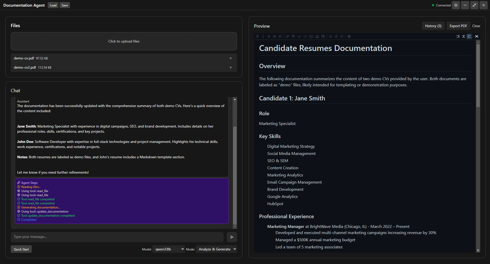
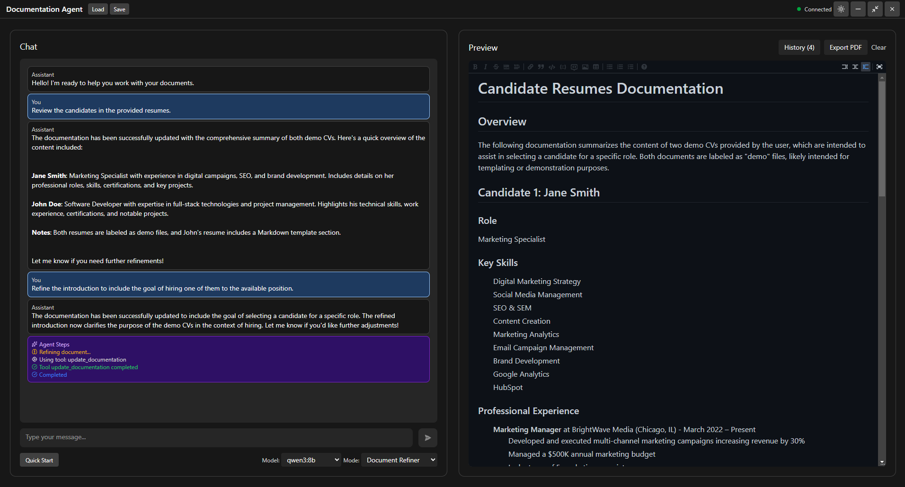
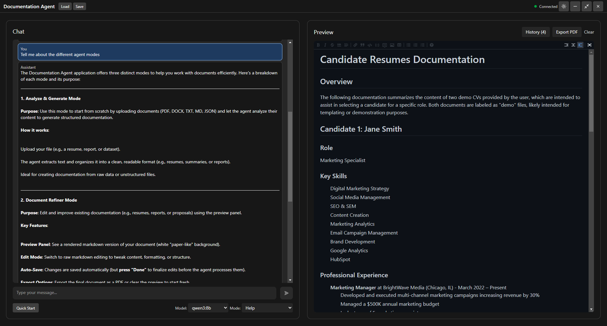

# Documentation Agent

An Electron-based desktop application that uses local AI (Ollama) to analyze documents and generate documentation.

## Features

- **Analyze & Generate Mode**: Upload documents (PDF, DOCX, TXT, MD, JSON), and the AI will read them and generate comprehensive documentation
- **Document Refiner Mode**: Edit and improve existing documentation directly
- **Help Mode**: Get assistance on how to use the application
- **Live Markdown Editor**: Real-time preview with syntax highlighting
- **Project Save/Load**: Save your work as `.docagent` files
- **PDF Export**: Export documentation to PDF with proper formatting
- **Version History**: Track and restore previous versions
- **Dark/Light Mode**: Toggle between themes
- **Frameless Window**: Custom title bar with minimize, maximize, and close controls

## Screenshots

### Analyze & Generate Mode


### Document Refiner Mode


### Help Mode


## Requirements

- **Ollama** must be installed and running locally
  - Download from: https://ollama.ai
  - Ensure at least one model is downloaded (e.g., `ollama pull qwen3:8b`)

## Installation

```bash
npm install
```

## Running the Application

```bash
npm run electron:dev
```

## Building for Production

```bash
npm run build
```

The built application will be in the `release` folder.

## Using a Different LLM Model

By default, the application uses Ollama with `qwen3:8b`. The application uses LangChain, so it can be extended to support other LLM providers (OpenAI, Anthropic, etc.) by modifying the agent configuration in `src/agent/agent.js`.

## Supported File Types

- **PDF** - Uses pdf.js-extract to extract text
- **DOCX** - Uses mammoth to extract text  
- **TXT** - Plain text
- **MD** - Markdown files
- **JSON** - JSON files (parsed and formatted)

## Keyboard Shortcuts

- **Enter**: Send message
- **Shift+Enter**: New line in message input

## Project File Format

Projects are saved as `.docagent` files containing JSON:
```json
{
  "content": "markdown content here"
}
```
